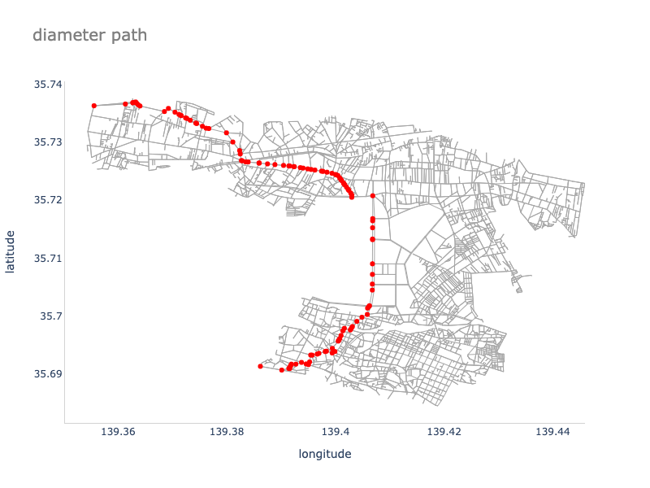
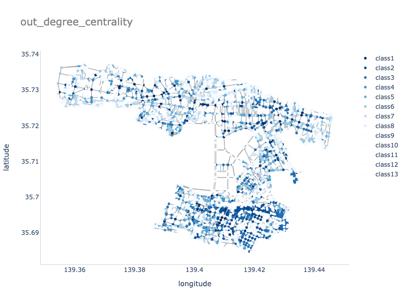
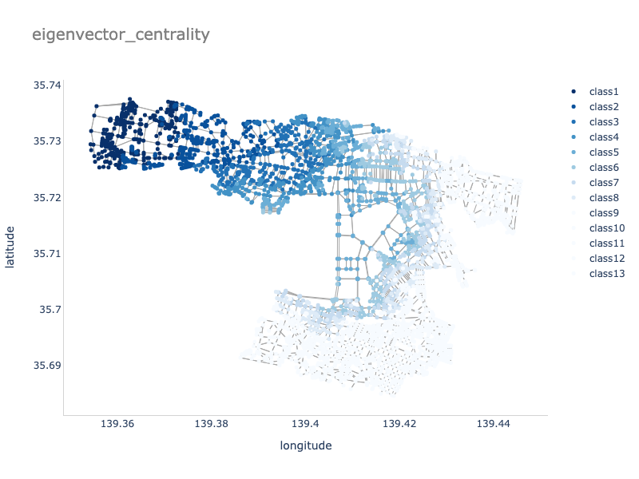
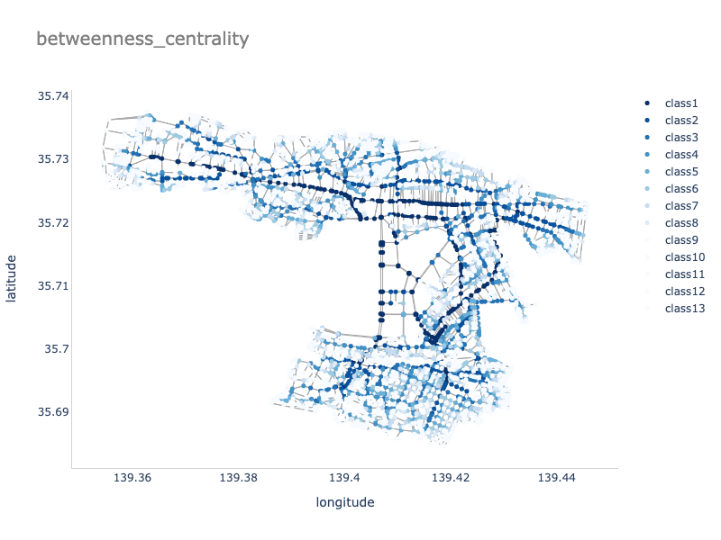
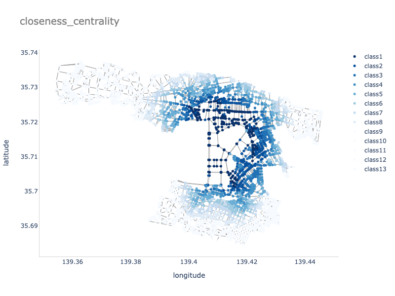
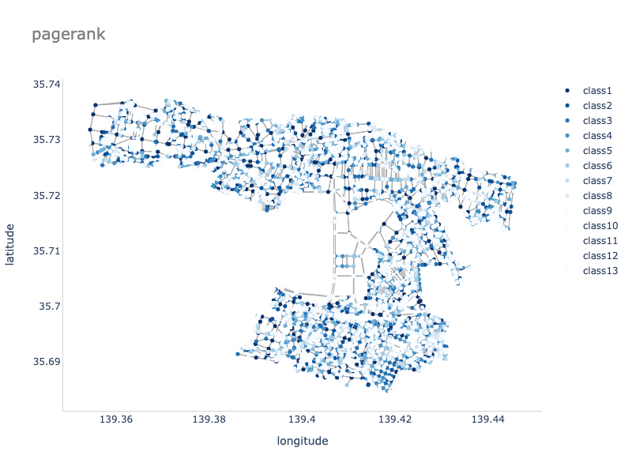
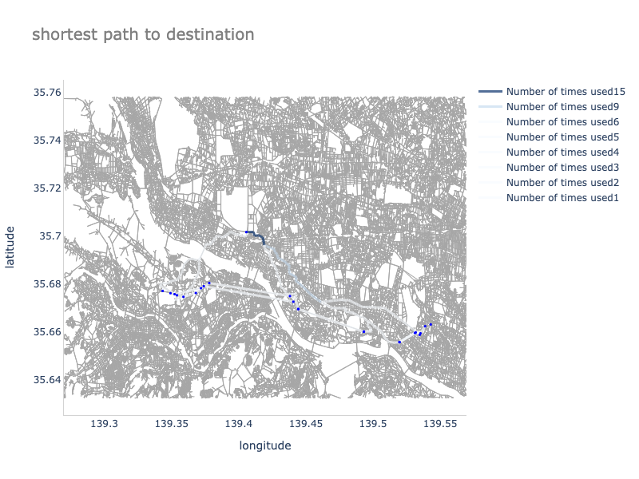
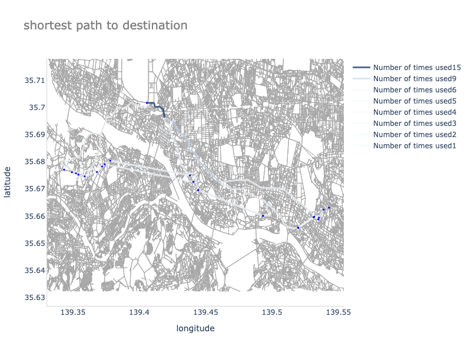
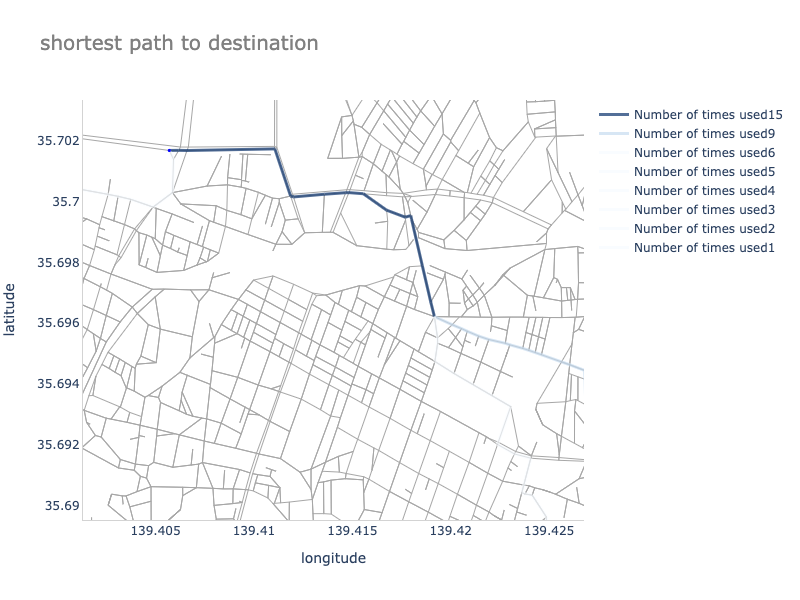

## 分析対象

立川市の道路ネットワーク

## データ

### 道路ネットワーク


- Open Street Map から取得した立川市道路ネットワーク
- `source`から`target`への向きをもつ edge が定義された`Digraph`
- 2 つの node 間に 2 つの edge を持つ場合がある`MultiDigraph`
- `source`から`target`への車線数は`lane`で定義される

#### ノード（交差点）に含まれる情報

```
{
    y: 緯度,
    x: 経度,
    highway: {
        traffic signals: 信号機,
        crossing: 横断歩道
    },
    street_count: 交差点が繋がる道路の数
}
```

#### エッジ（道路）に含まれる情報

```
{
    osmid: Open Street Map 上の道路 ID,
    name: 道路の名前,
    highway: {
        primary: 大きな街を結ぶ道路,
        secondary: 町を結ぶ道路(primaryの次に重要),
        tertiary: 小さい町や村を結ぶ道路(secondaryの次に重要),
        unclassified: 村や村落を結ぶ道路(最も重要度の低い道路),
        residential: 住宅沿いの道路,
    },
    oneway: 一方通行かどうか(True/False),
    length: 道路の長さ,
    lanes: 車線の数,
    maxspeed: 最高時速,
}
```

### 交通量

[全国道路・街路交通情勢調査](https://www.mlit.go.jp/road/ir/ir-data/ir-data.html)

- 平成 22 年度 全国道路・街路交通情勢調査一般交通量調査 集計表
- 平成 27 年度 全国道路・街路交通情勢調査一般交通量調査 集計表

[交通量統計表 警視庁](https://www.keishicho.metro.tokyo.lg.jp/about_mpd/jokyo_tokei/tokei_jokyo/ryo.html)

- 令和元年 交通量統計表 警視庁
- 令和 2 年 交通量統計表 警視庁

## 分析方法

1. 道路ネットワークの可視化 (ノード：交差点)
2. ネットワークの基本特徴量を算出
3. 中心性指標に基づいてグラデーションで色付けしプロット
4. 交通量をエッジに重み付けし、重みを可視化に反映
5. ネットワーク指標を用いて回帰分析?

#### 基本特徴量

- [x] ノード数
- [x] エッジ数
- [x] 次数のヒストグラム
- [x] 次数分布
- [x] 平均次数
- [x] 平均ノード間距離(道路の長さが距離)
- [x] ネットワークの直径(shortest path length の中で最大のもの)
- [x] エッジ密度
- [x] クラスター係数
- [x] 平均クラスター係数
- [x] 次数中心性
- [x] 固有値中心性
- [x] 媒介中心性
- [x] 近接中心性
- [x] ページランク

#### オプション特徴量(意味を見出しにくい)

- [ ] ノード間距離の分布(各距離ごとのノード間距離の平均のグラフ)

### 実行

依存関係のインストール

```
$ pip install -r requirements.txt
```

立川市の道路データを取得

```
$ python3 fetch-road-network.py
```

## 結果

### 基本特徴量

| 名前               | 値        |
| ------------------ | --------- |
| 有向グラフ         | True      |
| ノード数           | 4106      |
| エッジ数           | 10515     |
| 平均次数           | 5.12      |
| 平均経路長         | 4044.685  |
| 直径               | 10418.409 |
| 密度               | 0.000624  |
| 平均クラスター係数 | 0.00188   |

### ネットワークの直径

直径：ネットワーク内で最も遠いノード間の距離. ノード間の最短距離の中で最も大きい値



### 中心性指標に基づくプロット

スタージェスの公式に基づいて中心性の値の階級数を決め、値が高いものから`class 1`として濃い色でプロットした.

#### 次数中心性

**入次数**


**出次数**


#### 固有値中心性



#### 媒介中心性



#### 近接中心性



#### ページランク



### 中央自動車道から昭和記念公園までの最短経路






