## 目次

- [立川市の道路ネットワーク](#立川市の道路ネットワーク)
- [指定範囲の道路ネットワーク](#指定範囲の道路ネットワーク)

# 立川市の道路ネットワーク

## 分析対象

立川市において、以下の道路が非常に混雑する問題がある。この混雑の要因を分析することが目的である。


## データ

### 道路ネットワーク


- Open Street Map から取得した立川市自動車道路ネットワーク（自動車が走行可能な道路を含み、歩道、自転車道などは含まない）
- `source`から`target`への向きをもつ edge が定義された`Digraph`
- 2 つの node 間に 2 つの edge を持つ場合がある`MultiDigraph`

#### ノード（交差点）に含まれる情報

```
{
    y: 緯度,
    x: 経度,
    highway: {
        traffic signals: 信号機,
        crossing: 横断歩道
    },
    street_count: 交差点が繋がる道路の数
}
```

#### エッジ（道路）に含まれる情報

```
{
    osmid: Open Street Map 上の道路 ID,
    name: 道路の名前,
    highway: {
        primary: 大きな街を結ぶ道路,
        secondary: 町を結ぶ道路(primaryの次に重要),
        tertiary: 小さい町や村を結ぶ道路(secondaryの次に重要),
        unclassified: 村や村落を結ぶ道路(最も重要度の低い道路),
        residential: 住宅沿いの道路,
    },
    oneway: 一方通行かどうか(True/False),
    length: 道路の長さ,
    lanes: 車線の数,
    maxspeed: 最高時速,
}
```

### ネットワークの直径

直径：ネットワーク内で最も遠いノード間の距離. ノード間の最短距離の中で最も大きい値


## 分析方法

1. 道路ネットワークの可視化 (ノード：交差点)
2. ネットワークの基本特徴量を算出
3. 中心性指標に基づいてグラデーションで色付けしプロット

#### 基本特徴量

- [x] ノード数
- [x] エッジ数
- [x] 次数のヒストグラム
- [x] 次数分布
- [x] 平均次数
- [x] 平均ノード間距離(道路の長さが距離)
- [x] ネットワークの直径(shortest path length の中で最大のもの)
- [x] エッジ密度
- [x] クラスター係数
- [x] 平均クラスター係数
- [x] 次数中心性
- [x] 固有値中心性
- [x] 媒介中心性
- [x] 近接中心性
- [x] ページランク

## 結果

### 基本特徴量

| 名前               | 値        |
| ------------------ | --------- |
| 有向グラフ         | True      |
| ノード数           | 4106      |
| エッジ数           | 10515     |
| 平均次数           | 5.12      |
| 平均経路長         | 4044.685  |
| 直径               | 10418.409 |
| 密度               | 0.000624  |
| 平均クラスター係数 | 0.00188   |

### 次数のヒストグラム

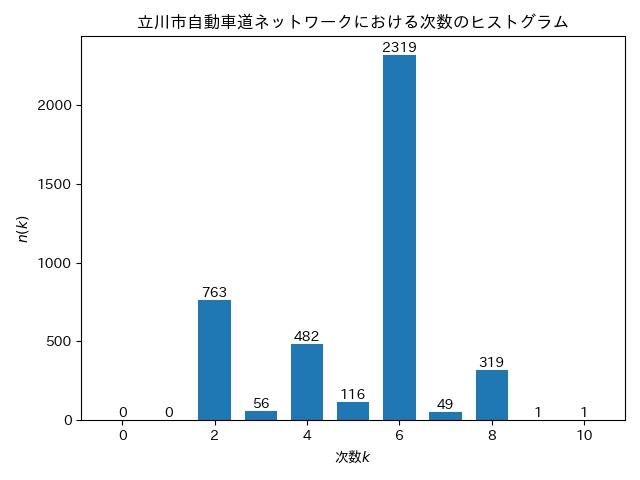

### 次数分布


### 中心性指標に基づくプロット

スタージェスの公式に基づいて中心性の値の階級数を決め、値が高いものから`class 1`として濃い色でプロットした.

#### 次数中心性

**入次数**


**出次数**


#### 固有値中心性


#### 媒介中心性


#### 近接中心性


#### ページランク


# 指定範囲の道路ネットワーク

## データ

### 道路ネットワーク

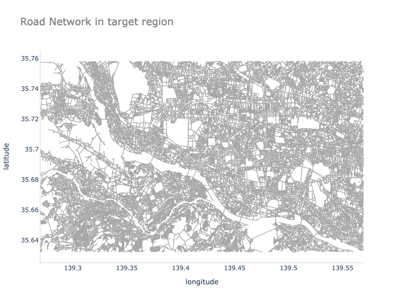

- Open Street Map から取得した道路ネットワーク（自動車が走行可能な道路を含み、歩道、自転車道などは含まない）
- 以下の範囲内の道路を box として取得

```
- 北緯：羽村駅(35.7582678)
- 南緯：高尾山口駅(35.63224825)
- 西経：高尾山口駅(139.2699457715528)
- 東経：登戸駅(139.56954570683286)
```

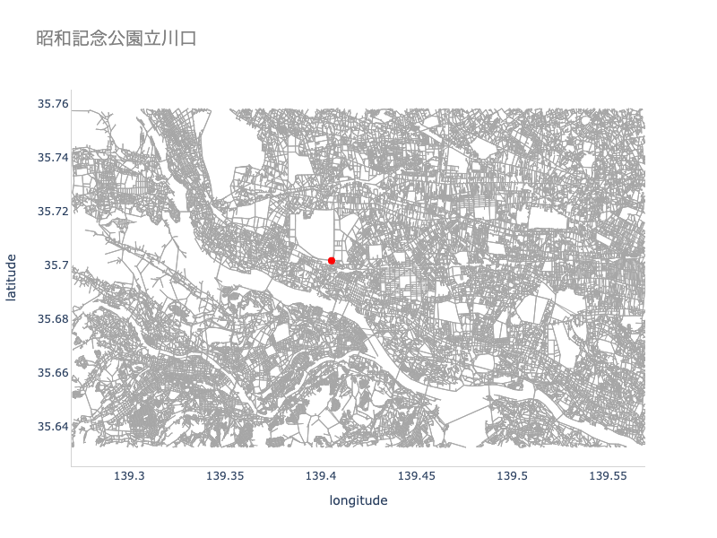

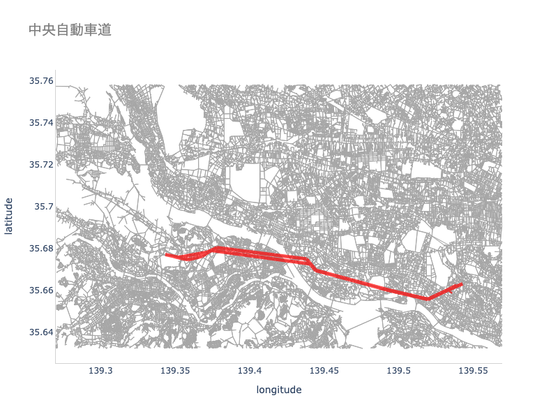

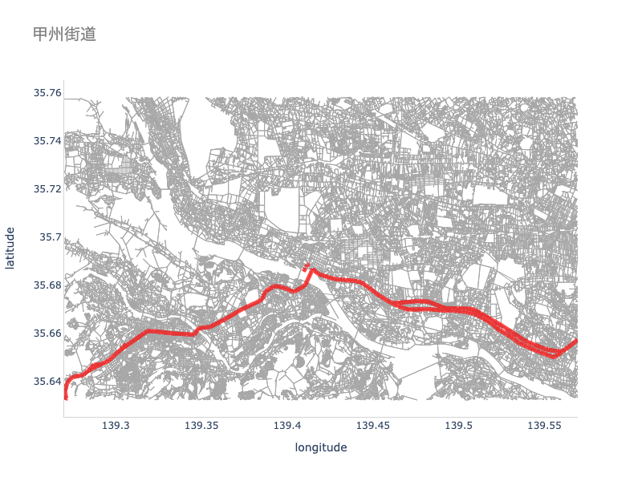

## 分析方法

1. 道路ネットワークの可視化 (ノード：交差点)
2. ネットワークの基本特徴量を算出
3. 中心性指標に基づいてグラデーションで色付けしプロット
4. 緯度 35.66 以南の交差点から目的地までの最短経路を算出
5. 最短経路に含まれている回数が多い道路ほど濃い色でプロット
6. 緯度 35.66 以南の交差点から目的地までの最短時間経路を算出
7. 最短時間経路に含まれている回数が多い道路ほど濃い色でプロット

#### 基本特徴量

- [x] ノード数
- [x] エッジ数
- [x] 次数のヒストグラム
- [x] 次数分布
- [x] 平均次数
- [x] エッジ密度
- [x] クラスター係数
- [x] 平均クラスター係数
- [x] 次数中心性
- [x] 固有値中心性

**※ 媒介中心性・近接中心性・ページランクは計算実行時間の制約（計算に約 21 年かかる）のため計算していない。**

## 結果

### 基本特徴量

| 名前       | 値         |
| ---------- | ---------- |
| 有向グラフ | True       |
| ノード数   | 71532      |
| エッジ数   | 194969     |
| 平均次数   | 2.846      |
| 密度       | 3.8104e-05 |

### 次数のヒストグラム

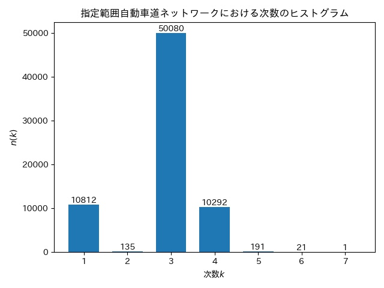

### 次数分布

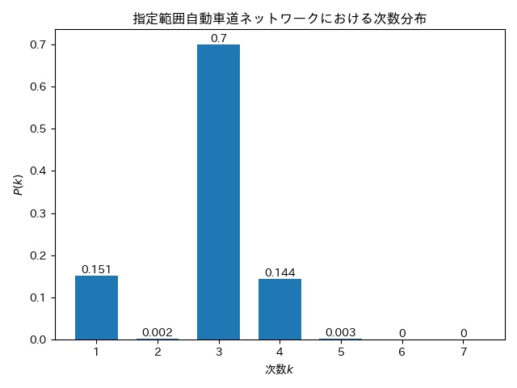

### 中心性指標に基づくプロット

#### 次数中心性

**入次数**
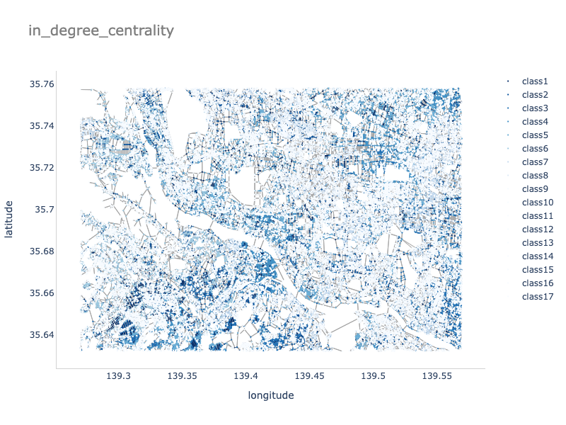

**出次数**
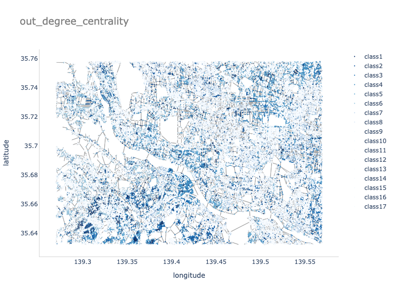

#### 固有値中心性


### 昭和記念公園までの最短経路

緯度 35.66 以南の 15850 個の交差点から昭和記念公園立川口への最短経路を導出し、より多く使われている道路を濃い色でプロットした。図の凡例は使われた回数を意味している。

重みを（交差点から交差点をつなぐ）道路の長さとして、ダイクストラ法を用いて重み（距離）が最小となる経路をあるノードから目的地への最短経路としてプロットした。

道路が使われた回数に基づく配色はスタージェスの公式を用いて決定した。具体的には、k を階級数、N を道路の使用回数のパターン数（使用された回数が 1,3,5,10 ならばパターン数は 4)として以下のように計算する。

k = 1 + round(log_2 N)

求められた階級数を用いて階級の幅 w を

w = ceil(max{道路の使用回数} / k)

として計算し、それぞれの階級に基づいて道路の色を決定した。

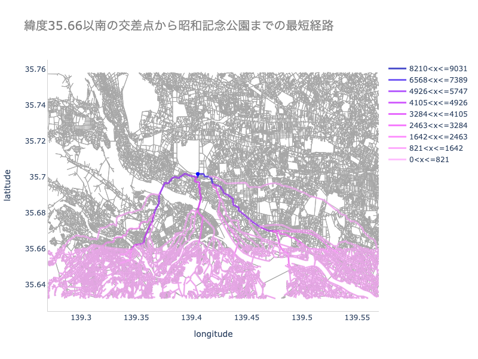

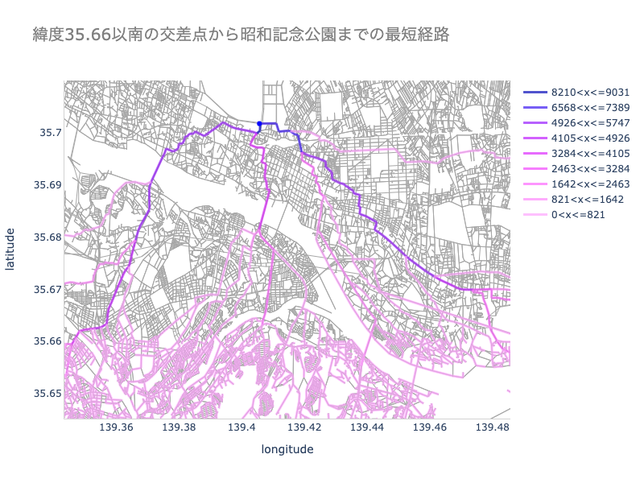

### 昭和記念公園までの最短時間経路

緯度 35.66 以南の 15850 個の交差点から昭和記念公園立川口への最短時間経路を導出し、より多く使われている道路を濃い色でプロットした。図の凡例は使われた回数を意味している。

各道路を通過するのに要する時間は

所要時間(m/h) = 道路の長さ(m) / (法定速度(km/h) \* 1000)

で計算し、これを各道路（エッジ）の重みとした。ダイクストラ法を用いて重み（所要時間）が最小となる経路をあるノードから目的地への最短時間経路としてプロットした。


### ランダムなノードからの最短時間距離


### 新しい道路の設置

新しい道路 1


新しい道路 2

